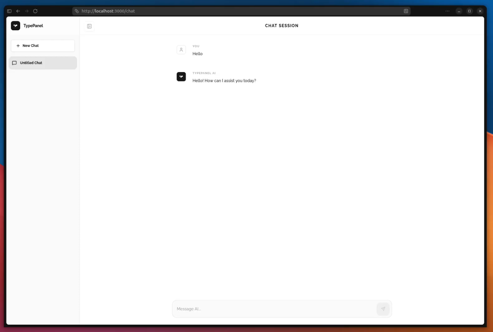

# Entry 5

##### 04/19/2026

### Content: Finishing Freedom Project MVP

Over the spring break, I finally I began working on the core MVP of my freedom project, which is allowing users to create custom AI models using a RAG (Retrieval-Augmented Generation) system with pgvector and create the actual chat page.

To allow users to train and customize their AI, I first needed a way to provide information to the model. There are several approaches, such as prompting and fine-tuning. While both are simple to implement, they can become expensive due to frequent API calls. Because of this, I decided to use RAG. RAG works by retrieving relevant information from an external source and injecting it into the AI prompt based on the user's query. To do this, I needed a way to store and search vector embeddings. Since [PostgreSQL](https://www.postgresql.org/) does not natively support vector data types, I researched how to enable the pgvector extension. I found an article from [EnterpriseDB](https://www.enterprisedb.com/blog/what-is-pgvector) to better understand concepts like vectors, similarity search, and embeddings. After following the tutorial, I successfully enabled pgvector extension in my database.

After setting up the database, I created a function called `chunkText()` to split large pieces of text into smaller overlapping chunks. I also implemented `getEmbedding()`, which generates vector embeddings for each chunk using either OpenAI or Google APIs depending on the config.

`chunkText()`

```typescript
const chunkText = (
  text: string,
  size: number = 1000,
  overlap: number = 200,
): string[] => {
  const chunks: string[] = [];
  let start = 0;

  while (start < text.length) {
    const end = start + size;
    chunks.push(text.slice(start, end));
    start += size - overlap;
  }
  return chunks;
};
```

`getEmbedding()`

```typescript
const getEmbedding = async (
  text: string,
  config: ProviderConfig,
): Promise<number[]> => {
  if (config.name === "openai") {
    const res = await fetch("https://api.openai.com/v1/embeddings", {
      method: "POST",
      headers: {
        "Content-Type": "application/json",
        Authorization: `Bearer ${config.apiKey}`,
      },
      body: JSON.stringify({
        input: text,
        model: "text-embedding-3-small",
      }),
    });
    const data = await res.json();
    return data.data[0].embedding;
  }

  if (config.name === "google") {
    const res = await fetch(
      `https://generativelanguage.googleapis.com/v1beta/models/text-embedding-004:embedContent?key=${config.apiKey}`,
      {
        method: "POST",
        headers: { "Content-Type": "application/json" },
        body: JSON.stringify({
          content: { parts: [{ text }] },
        }),
      },
    );
    const data = await res.json();
    return data.embedding.values;
  }

  throw new Error(`Unsupported AI provider: ${config.name}`);
};
```

Once that was working, I created functions to actually use the data. The `ingestDocument()` function stores the embeddings in the database, and `searchKnowledge()` looks through them to find the most relevant information when the user asks something. That's basically the core of the RAG system. I used these functions through data access layer I created and implement them on the platform. After all the backend logics were completed for chatbot and knowledge base creation, I worked on the chat UI. For the chat UI, I took inspiration from ChatGPT and Gemini website.



### Engineering Design Process

I am currently between Step 6 **(Test and evaluate the prototype)** and Step 7 **(Improve as needed)** of the Engineering Design Process. So far, I finished the core MVP of the project. I built the RAG system and the chat UI that you can use to talk to AI chatbots.

### Skills

##### 1. Time management

Time management was an essential skill for my project because I don't have a lot of time and not only I have to build the RAG system, but I also have to integrate it into my platform and build the chat page. I really have to manage my time correctly in order to get everything done on time while maintaing a clean codebase.

##### 2. How to Google

Using Google effectively was another important skill. Since I have never built RAG system before, I have to learn by searching up on Google. Most tutorials I found are using python, which is not what my project uses. I decided to google how RAG works exactly and built RAG system in TypeScript by myself.

### Next Step

For the next step of my Freedom Project, I want to clean things up and add a file upload feature so users can easily add their own data to train their AI. Right now everything works, but it still feels a bit basic, so I'm going to improve the chat layout and make it more user friendly. I also need to test everything more carefully and fix any bugs I find so the project runs smoothly.

[Previous](entry04.md) | [Next](entry06.md)

[Home](../README.md)
